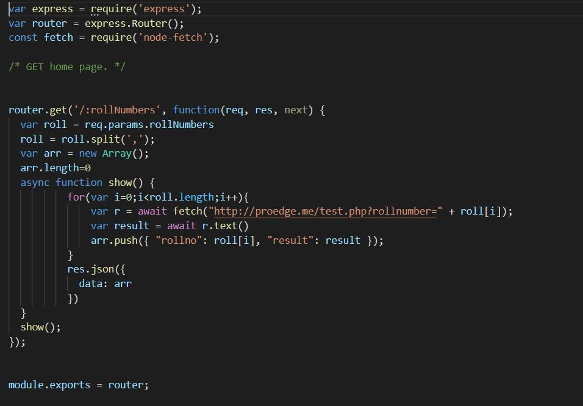

# Proedge

## URL (hosted on heroku) - https://proedge-assignment.herokuapp.com/
## Backend API (hosted on heroku) - https://proedge-api.herokuapp.com/{string containing comma seprated roll numbers}
## To avoid CORS issue - https://ancient-tor-34194.herokuapp.com/ is added before to the backend API URL
## Libraries Used-
### Frontend (reactJS) -
1) Fetch
### Backend (nodeJS) -
1) express
2) node-fetch
## Test Case-
### Input: 5,6,9,12,18,20,25,30,32,36,37,38,40,42,45,47,49,50

## Components -
### Frontend -
In APP.jsx 

useState is used, on click of button the input form value is assigned to input value and if it is not empty string the backend api is called and the result JSON formatted data is stored in data.

Input form, button is rendered and table is rendered from data using map. 
### Backend -

In this string after the link https://proedge-api.herokuapp.com/ or on lochalhost::8000 is params then the string comma seprated value are parsed into integer and for every value http://proedge.me/test.php?rollnumber={value} api is called and result is stored in object with key value pair of roll no and result, and that array of objects is finally returns.

